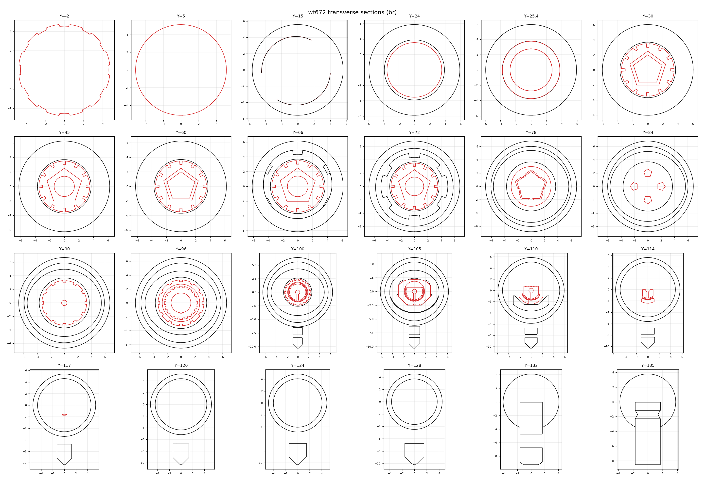
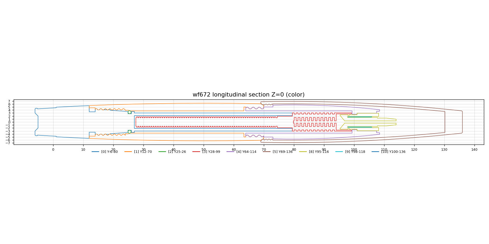
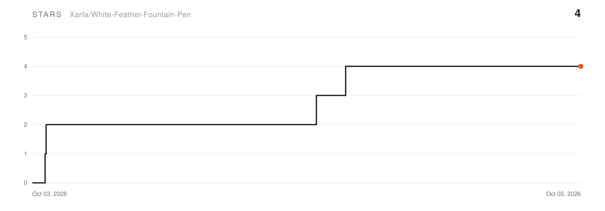

# White Feather Fountain Pen

### Bailing · ein Open-Source-3D-Druck-Füller

&nbsp;

[English](README.md) · [简体中文](README.zh-CN.md) · [Русский](README.ru.md) · [日本語](README.ja.md)

<a href="https://xarfa.github.io/wffp/"><b>Alle Details unter xarfa.github.io/wffp</b></a>

---

## Die Idee

wf672 ist ein originaler 3D-gedruckter Füller des Autors. Lade die STL aus den Releases und baue deinen eigenen — danach erkunde alles selbst. Bitte frag den Autor nicht nach Dateien, die nie offen gelegt wurden (Handbücher inklusive): Die STL ist das ganze Projekt.

Bailing (白翎) war 1968 die Automatik-Sauger-Linie der Dandong-Federfabrik: ein gerippter Kapillarkern – Sammler nennen ihn den „Maiskolben“ – saugt Tinte bei Kontakt; wf672 baut genau diese Struktur nach.

## Star History

<picture>
  <source media="(prefers-color-scheme: dark)" srcset="assets/star-history-dark.svg">
  
</picture>

*wöchentlich automatisch aktualisiert · © 2026 Xarfa*

