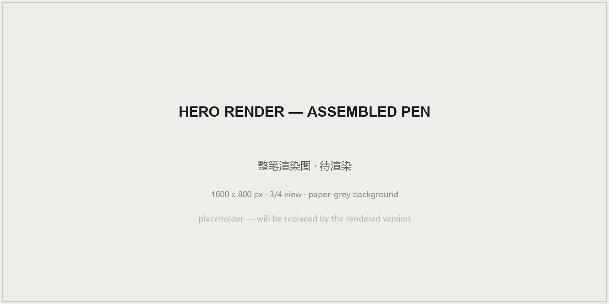
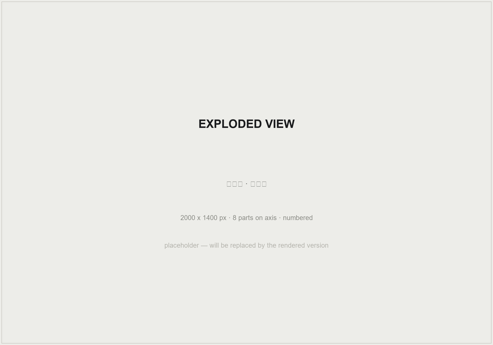
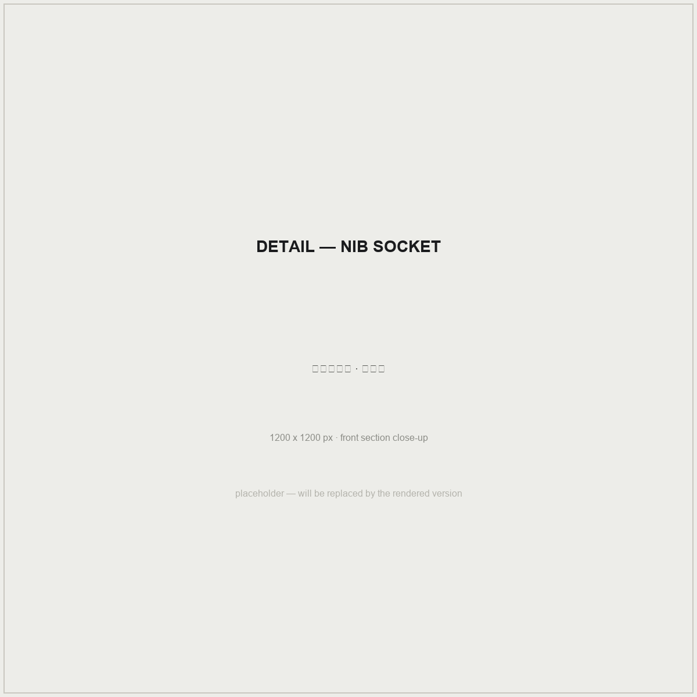
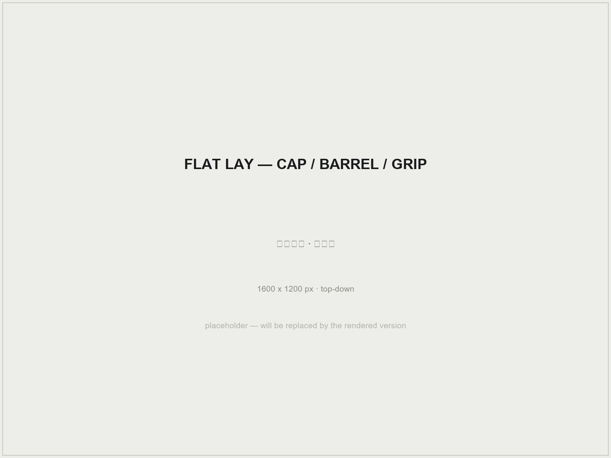
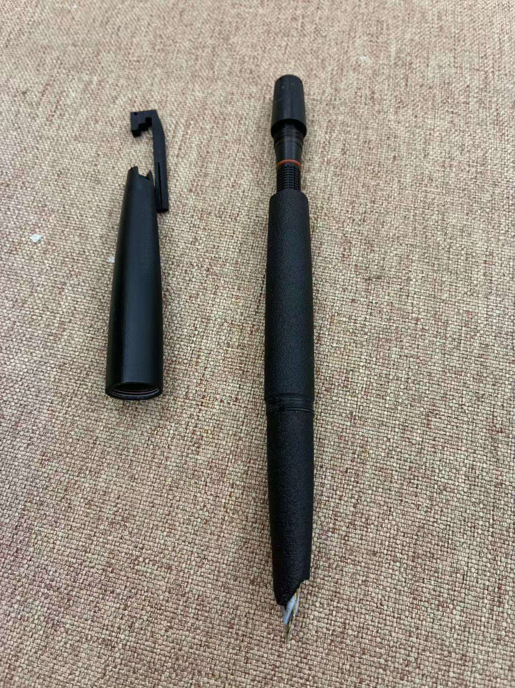
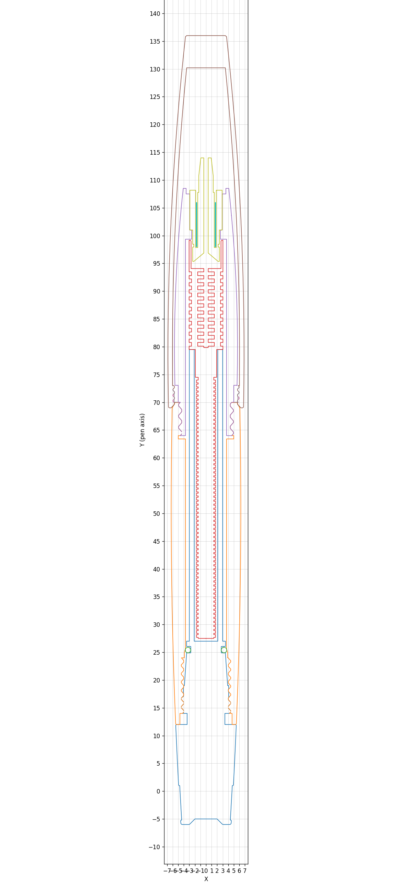
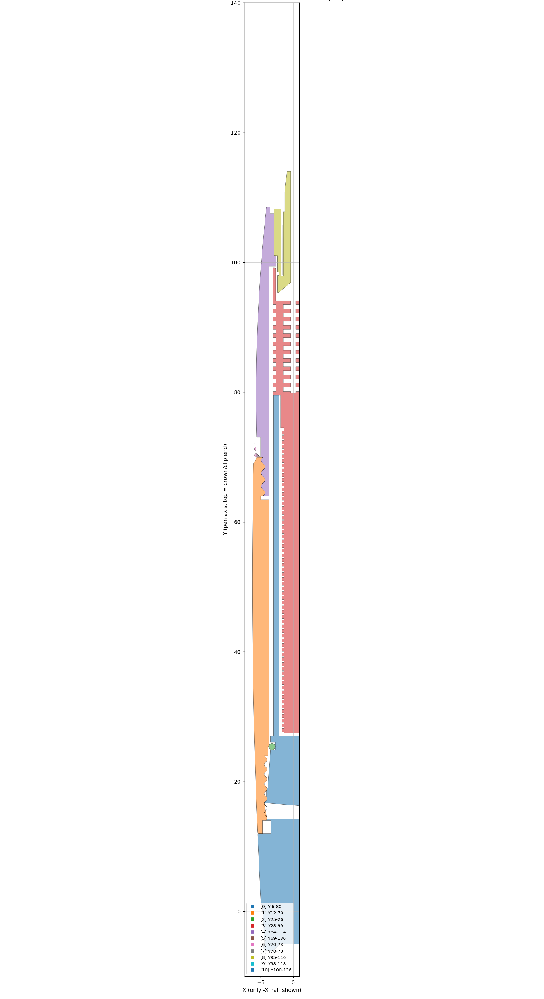
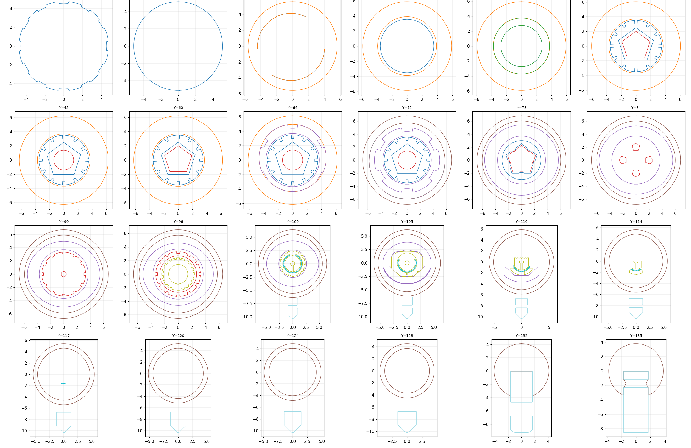
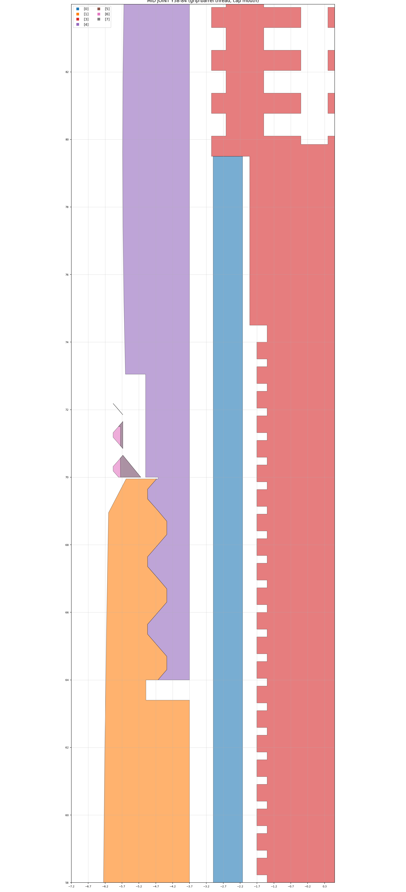

<!-- 渲染图就位说明：docs/hero.png · exploded.png · detail-nib.png · flatlay.png 为占位图，
     用你渲染好的图按同名覆盖即可，尺寸要求见占位图内标注。 -->

# White Feather Fountain Pen

**wf672 · a modular 3D-printable pen body for the standard 18.5 mm hooded nib**

简体中文 &nbsp;·&nbsp; 适配市售 18.5mm 暗尖笔芯的模块化 3D 打印钢笔笔身

 

## Overview

**EN** — White Feather (wf672) is a modular fountain-pen body you print yourself. It takes a commonly available **18.5 mm hooded (concealed) nib unit**, so the writing character comes from a standard part you can buy today — the printed body carries the grip, barrel, cap, clip, and the inner ink path. One STL, five separate solids, everything in assembly position.

**中文** — 白翎（型号 wf672）是一支自己动手打印的模块化钢笔笔身：适配**市售通用 18.5mm 暗尖笔芯**，书写性能由买得到的标准件决定，打印件负责笔握、笔杆、笔帽、笔夹与内部墨路。单 STL 文件含 5 个独立实体，全部保持装配位姿。

## Highlights

- **Modular / 模块化** — threaded sections come apart for cleaning, swapping and modification；螺纹分段可拆装，便于清洗与改装
- **Standard nib / 通用笔芯** — no exotic parts: the 18.5 mm hooded nib unit is an off-the-shelf item；笔芯为市购标准件
- **Print-friendly / 打印友好** — one file, five solids, split with "Split to objects"；切片时按零件拆分即可
- **Open license / 开放许可** — CC BY 4.0, commercial use allowed；允许商用（详见许可证）

## Gallery

| | |
|---|---|
|  |  |

<kbd>Exploded view 爆炸图</kbd> · <kbd>Nib socket detail 笔尖座细节</kbd>

| | |
|---|---|
|  |  |

**Section drawings / 工程剖切图**

| Longitudinal section 纵向剖视 | Half section, filled 半剖填色 |
|---|---|
|  |  |

| Transverse sections 横断面图集 | Thread joint detail 螺纹连接细节 |
|---|---|
|  |  |

## Specifications · 规格

| | |
|---|---|
| Overall length 总长 | **142 mm** |
| Max diameter 最大外径 | **Ø13.7 mm**（with clip 含笔夹 ≈ 17 mm） |
| Nib unit 笔芯 | 18.5 mm hooded, purchased 暗尖笔芯 · 市购 |
| Units 单位 | mm |
| Solids 实体数 | 5（single STL 单文件） |

## Repository contents · 仓库内容

| File 文件 | Description 说明 |
|---|---|
| `wf672_v1.0.0.stl` | Pen body print file 笔身打印文件（5 solids 含笔帽、笔杆等） |
| `docs/` | Renders & engineering sections 渲染图与工程剖切图 |
| `photos/` | Real photos 实物照片 |
| `assets/` | Star history chart 星标曲线（auto-updated weekly 每周自动更新） |

> After importing into Bambu Studio / OrcaSlicer / PrusaSlicer, use **Split to objects** to separate the 5 parts. Parts stay in assembly position — rearrange and orient them for printing.
> 导入切片软件后使用「按零件拆分」分成 5 个零件；拆分后保持装配位姿，需手动摆盘与定向。

**Printing 打印** — parameters vary by machine and material; the community's tested settings live in [Issues](../../issues). 打印参数因机型材料而异，欢迎在 Issue 分享你的实测配置。

## Not included · 未包含

- The **18.5 mm hooded nib unit** is a purchased standard part and is not distributed here. 暗尖笔芯为市购标准件，不在本仓库分发范围。
- CAD source files (Fusion) are reserved by the author. CAD 源文件由作者保留。
- Fountain pen inks can degrade some plastics — test before long-term use. 墨水与塑料的长期兼容性请自行评估。

## License · 许可证

Released under **CC BY 4.0** — copy, modify, redistribute and sell allowed with attribution. The license grants no trademark rights: derived works must not use the names "白翎 / Bailing / wf672".

本项目采用 **CC BY 4.0（署名 4.0 国际）** 发布，全文见 [LICENSE](LICENSE)。允许复制、修改、再分发与商用（需注明来源）；本许可证不授予商标权——衍生品请使用你自己的命名，"白翎 / Bailing / wf672" 保留给原作。© 2026 Xarfa

## Contributing · 贡献

Print parameters, failure reports and improvement ideas are welcome via [Issues](../../issues) — see [CONTRIBUTING.md](CONTRIBUTING.md). 欢迎通过 Issue 反馈打印参数、失败案例与改良思路。

## Star History

<picture>
  <source media="(prefers-color-scheme: dark)" srcset="assets/star-history-dark.svg">
  
</picture>

*Auto-updated every Monday · 每周一自动更新*

